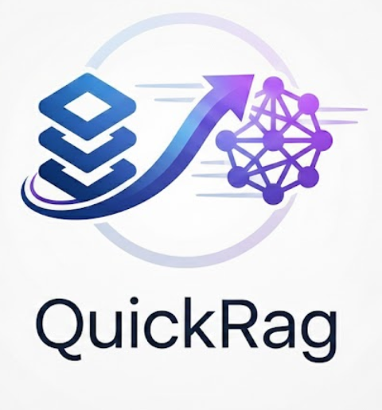

# QuickRag


<p align="center">
    
    <br>
    
    <a href="https://github.com/ton_compte/QuickRag">
        
    </a>
    
</p>

QuickRag is a simple and minimal package to create **RAG workflows** from PDFs.  
It allows you to load PDF documents, split them into chunks, and store them in a **ChromaDB vector store** for retrieval-augmented generation tasks.

---

## 🚀 Quick Start

### Clone and install
```bash
git clone https://github.com/ton_compte/QuickRag.git
cd QuickRag

# optional: create a virtual environment
python -m venv .venv
source .venv/bin/activate  # Linux / Mac
.venv\Scripts\activate     # Windows

# install dependencies
pip install -r requirements.txt
pip install -e .            # editable install for development

